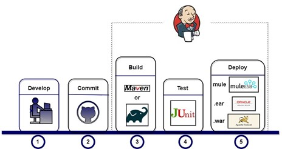
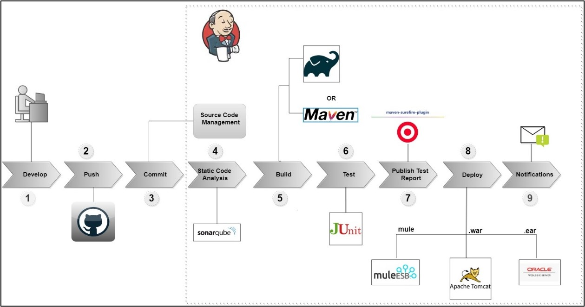
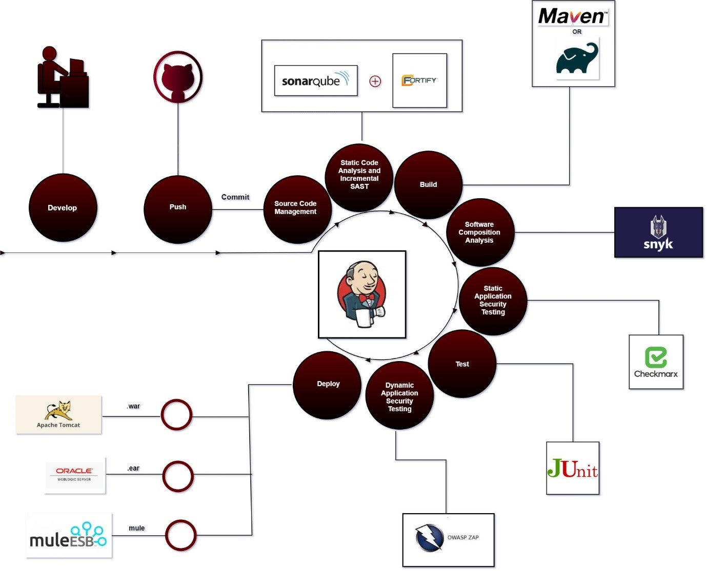
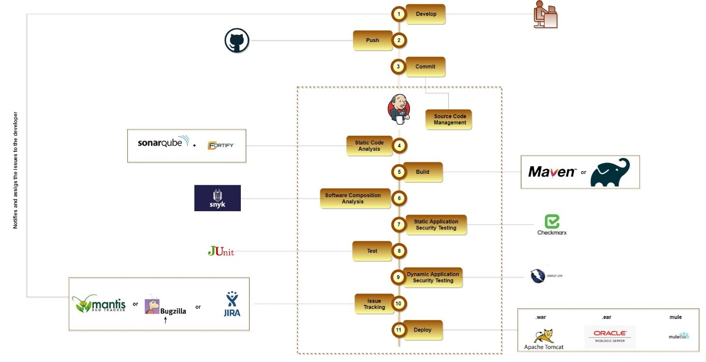

# CI/CD Pipeline:

The CI/CD pipeline coordinates the streaming of the source code to the production environment, which is carried out through brief cycles of building, testing, deployment, and release. It primarily aims in automating and integrating continuous monitoring into the Software Development Lifecycle. Continuous Integration forms the initial stage that aims in enhancing the reliability of the code. Here, the initial code building and testing is performed. The CI facilitates the early detection and elimination of bugs in the code. The tests ensure the proper working of the code in various environment and hence, end-to-end efficiency can be achieved. The integration and automation ensure frequent release of high-quality software by reducing the odds of human errors. 

## How is it acheieved? :

            

The CI/CD constitutes of an automated cycle of build-package-test- deploy. Continuous Integration can be achieved using automation tools such as Jenkins. 
- **Source** - It is the initial stage that accounts for the code commit and the version control. GIT tool is used for this.
- **Build** - Whenever a code is committed, an automated build and test is activated by the CI server. The build stage is employed by combining the source code and its associated dependencies to a runnable instance for deployment. This stage reflects on underlying concerns of the source code. Maven, Gradle tools are used at this stage.
- **Test** - Testing is the key step as it will reflect on the quality and validates the behavior of the software. Junit testing, which is a unit testing framework is carried out at this stage.
- **Deploy** - A successful build and test will trigger the deployment process where the application is deployed to its environment.

## How is it evolving? :

- It is essential to restructure the software development lifecycle through an effective continuous integration and continuous deployment pipeline.
- An efficient CI/CD would call for a continuous improvement in its practices that aligns with its shifts in the business needs. 
- The basic pipeline can be enhanced with feedback, security, and continuous monitoring standpoint. These perspectives will provide visibility on the quality and behavior of the code and hence, facilitate impeccable release to the production. 
- To accomplish the above, it is important that the testing is carried out at the early stages of the development cycle. The left shift approach is essential in DevOps. It carries out the **static code analysis (SCA)**, **static application security testing (SAST)** and **dynamic application security testing (DAST)** before deployment. However, the pipelines can be enhanced based on the business requirements is discussed. 

### Code Review:

- It is a continuous inspection process, wherein the quality of the code is assessed in its non-runtime environment. It is an element of the static code analysis. 
- The code along with the associated security vulnerabilities are scrutinized. This analysis reflects on the part of the code that can be optimized. The quality check is carried out at an early stage before the build process. 
- To enable continuous inspection, SonarQube is integrated with Jenkins as a sonar scanner plugin. SonarQube analyzes the source code and provides a quality gate report. The progression of the pipeline is dependent on this quality gate report.

### Securing CI/CD Pipeline:

- Security in a CI/CD pipeline is instilled through continuous security validation and monitoring. Security validation through security tools can be carried out at each step in the development process. Testing forms an essential part in ensuring a quality software. 
- **Application Security Testing(AST)**, that identifies security threats in the source code is carried out for this. Two types of security testing, i.e., Static Application Security Testing (SAST) and Dynamic Application Security Testing (DAST) along with static code analysis is performed. 
- SAST tools accounts for the source code and its working in the non-runtime environment. SAST tools such as **SonarQube**, **CheckMarx**, **Synk** are integrated into the pipeline. DAST is a black box test, where testing is carried out in a runtime environment and analyzes the vulnerabilities encountered through external attacks. DAST is carried out in QA environment.

### Issue Tracking:

- To facilitate continuous monitoring and improvisation, tools like **Jira**, **BugZilla**, **Mantis** can be integrated to the CI/CD pipeline. This will enhance the visibility on the performance of the software. 
- Integrating these tools enables complete tracking and simultaneous updating of the issues in the pipeline. The following diagram depicts the Zira integration to the CI/CD pipeline.

 > The goal of achieving an uninterrupted and impeccable release to production can be achieved by integrating the various tools for testing, security, and issue tracking as a plugin into the Jenkins server. However, the tools integrated into the CI/CD pipeline can vary based on the requirements. Each pipeline is unique and is dependent on the customer and business needs. 

 > **We in InvenioLSI understand and support the variations in the requirements and the uses cases.**

 

